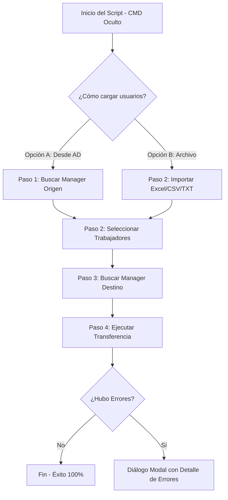

# Manual de Usuario y Operación
## Transferencia de Trabajadores en Active Directory (v1.0.0 by Fermin32)

Este manual describe el funcionamiento, políticas de uso y paso a paso para utilizar la herramienta gráfica de reasignación y transferencia masiva de trabajadores en Active Directory (AD).

---

## 🚀 ¿Qué hace este Script? (Flujo Simplificado)

El script automatiza el cambio del atributo `Manager` en las cuentas de usuario de Active Directory. Permite hacerlo de dos formas:
1. **De un manager a otro:** Seleccionando un manager de origen, viendo su lista de personas a cargo y pasándoselas a un nuevo manager.
2. **De forma masiva con un archivo:** Importando una lista de logins/usuarios desde un archivo de Excel, CSV o de texto plano y asociando a todos ellos el nuevo manager indicado.

---

## 📋 Requisitos Previos

Para ejecutar la herramienta con éxito, tu equipo debe cumplir con lo siguiente:
1. **Permisos de Administrador:** La herramienta solicita automáticamente privilegios elevados al iniciarse.
2. **Módulo de Active Directory (RSAT):** Debes tener instalado el módulo de PowerShell de AD. Si no lo tienes, el script te mostrará una alerta explicándote cómo instalarlo desde *Configuración > Aplicaciones > Características Opcionales*.
3. **Credenciales en el Dominio:** Tu usuario de red debe contar con privilegios de escritura en Active Directory para poder modificar el atributo `Manager` de otros usuarios.

---

## 🛠️ Guía Paso a Paso de Operación

### 1. Inicio Limpio (Sin Pantalla Negra)
Al hacer doble clic sobre `CopiarTrabajadores.bat`, la pantalla negra de la consola (CMD) se cerrará de forma automática al instante. La aplicación se ejecutará en total invisibilidad de terminal, mostrándote únicamente la ventana gráfica premium.

---

### 2. PASO 1 - Selección del Origen

Tienes **dos alternativas** para definir qué trabajadores vas a transferir:

#### Alternativa A: Buscar por el Manager actual (Origen)
1. Ve al cuadro **PASO 1 (Manager ORIGEN)** en la esquina superior izquierda.
2. Escribe el nombre o el login del manager que se va o cambia de rol y pulsa **Buscar en AD** (o presiona la tecla `Enter`).
3. El primer resultado coincidente se seleccionará de forma automática y se cargará su ficha de identidad. Si hay más coincidencias, puedes pulsar sobre la lista desplegable para seleccionar la correcta.
4. Al hacer la selección, sus trabajadores directos aparecerán listados automáticamente en la lista del **PASO 2** con sus casillas marcadas.

#### Alternativa B: Importar una lista externa (Excel / CSV / TXT)
1. Dirígete directamente al **PASO 2** y haz clic en el botón verde **Importar Excel/CSV**.
2. Selecciona tu archivo. El importador inteligente es compatible con:
   * **Excel (`.xlsx`, `.xls`):** Escanea automáticamente las columnas y prioriza la columna de "Usuario Nominal", **descartando activamente la columna "Usuario ADM"** (para evitar reasignar cuentas de administración por error).
   * **CSV / Texto (`.csv`, `.txt`):** Detecta separadores (comas o puntos y comas) de forma automática.
3. Se mostrará una **pantalla oscura de carga** indicando el progreso en tiempo real de la búsqueda de esos usuarios en Active Directory.
4. **Alerta de Usuarios no Encontrados:** Si hay logins en tu archivo que no existen en AD, el script registrará un aviso en la bitácora inferior y te mostrará una **ventana de advertencia personalizada en tono naranja** detallando exactamente qué cuentas fallaron para que puedas revisarlas.

---

### 3. PASO 2 - Gestión y Selección fina de Trabajadores
* En la lista de trabajadores, puedes marcar o desmarcar de manera manual a las personas concretas que deseas transferir.
* Dispones de los botones **Marcar todos** y **Desmarcar todos** para realizar selecciones masivas con un solo clic.

---

### 4. PASO 3 - Selección del Manager de Destino
1. Ve al cuadro **PASO 3 (Manager DESTINO)** en la esquina superior derecha.
2. Escribe el nombre o login del nuevo manager y pulsa **Buscar en AD** (o la tecla `Enter`).
3. Al seleccionarlo, en el cuadro de abajo a la derecha podrás visualizar en tiempo real quiénes son los trabajadores que tiene a su cargo en la actualidad para prevenir errores de reasignación.

---

### 5. PASO 4 - Ejecución de la Transferencia

1. Una vez seleccionado el destino y marcado al menos un trabajador, el botón principal **"PULSA PARA EJECUTAR TRANSFERENCIA"** se activará y comenzará a emitir un sutil pulso animado de color verde.
2. Haz clic en el botón. Aparecerá una ventana de confirmación detallando el Manager de Origen (o si viene de una Lista Importada), el Manager de Destino y la cantidad de trabajadores. Pulsa **Sí** para proceder.
3. Se abrirá una **pantalla de carga oscura en primer plano** que bloqueará los controles de la aplicación para evitar doble clics accidentales y te mostrará el avance y nombre del usuario procesado en tiempo real.
4. El script procesará cada cambio en Active Directory con una pequeña pausa para asegurar que no se sature el canal de red.

---

## 📊 Reportes y Diagnóstico de Errores

### ¿Qué pasa si un usuario tiene problemas?
El script cuenta con un sistema de diagnóstico inteligente que analiza cada fallo y lo traduce a lenguaje comprensible:
* Si la cuenta del usuario está inactiva en AD, se reportará como: *"La cuenta del usuario está DESHABILITADA en Active Directory."*
* Si no tienes permisos de escritura en la Unidad Organizativa (OU) de ese usuario: *"Permisos insuficientes en Active Directory (Acceso Denegado)."*
* Si el DistinguishedName del usuario cambió o el objeto fue eliminado: *"El usuario no existe o su DistinguishedName es incorrecto."*

### Ventana de Errores Final:
Si al finalizar la transferencia hubo algún problema con uno o más usuarios, tras mostrarse el mensaje de resumen del proceso, se abrirá automáticamente un **diálogo de reporte detallado en rojo coral**.
Este reporte te listará de manera limpia e individual:
* El nombre del trabajador fallido.
* Su login.
* La razón exacta por la que no se pudo cambiar su manager.

---
*Desarrollado y optimizado por Fermin32 - Versión 1.0.0*
